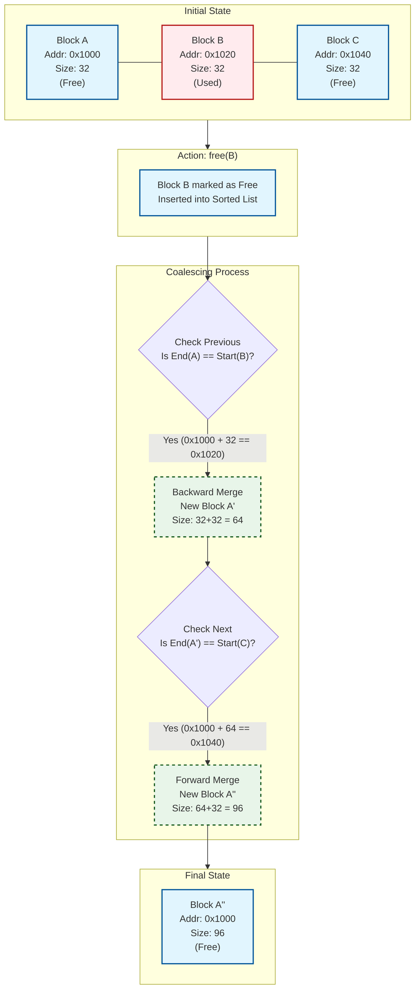

# ft_malloc

A custom implementation of the C standard library memory allocation functions (`malloc`, `free`, `realloc`), designed to manage memory efficiently using zones and blocks. This project mimics the behavior of the system's memory allocator while adding features like thread safety, block coalescing, and detailed memory visualization.

## Features

- **Zone Management**: Memory is managed in three distinct zones based on allocation size:
  - **TINY**: For allocations $\le$ 256 bytes (uses pre-allocated blocks).
  - **SMALL**: For allocations $\le$ 2048 bytes (uses pre-allocated blocks).
  - **LARGE**: For allocations $>$ 2048 bytes (uses direct `mmap`).
- **Thread Safety**: All exposed functions are thread-safe, protected by mutex locks.
- **Fragmentation Handling**: Implements block coalescing (merging adjacent free blocks) to reduce memory fragmentation.
- **Debug & Visualization**:
  - `show_alloc_mem()`: Displays the current state of allocated memory zones.
  - `show_alloc_mem_ex()`: Extended visualization showing fragmentation statistics and hex dumps of memory contents.
- **Configuration**: Global configuration flags for debugging and validation.

## Installation

To build the shared library:

```bash
make
```

This will compile the project and generate:
- `libft_malloc_$HOSTTYPE.so`: The shared library (e.g., `libft_malloc_x86_64_Linux.so`).
- `libft_malloc.so`: A symbolic link to the above library for convenience.

## Usage

### Using with LD_PRELOAD

You can use the custom allocator with existing applications by preloading the library:

```bash
# Linux
export LD_PRELOAD=./libft_malloc.so
ls -l

# MacOS
export DYLD_INSERT_LIBRARIES=./libft_malloc.so
ls -l
```

### Linking in Your Project

Include the header and link against the library:

```c
#include "includes/ft_malloc.h"

int main() {
    char *str = malloc(100);
    // ...
    free(str);
    return 0;
}
```

Compile with:

```bash
gcc main.c -L. -lft_malloc -o my_program
```

## API Reference

### Standard Functions

- `void *malloc(size_t size)`: Allocates `size` bytes of memory.
- `void free(void *ptr)`: Frees the memory space pointed to by `ptr`.
- `void *realloc(void *ptr, size_t size)`: Changes the size of the memory block pointed to by `ptr` to `size` bytes.

### Extension Functions

- `void show_alloc_mem()`: Prints the currently allocated memory blocks to standard output.
- `void show_alloc_mem_ex()`: Prints detailed memory information, including:
  - Zone summaries (TINY, SMALL, LARGE).
  - Hex dumps of block contents.
  - Fragmentation statistics.

## Testing

The project includes several test suites to verify functionality:

```bash
make test1  # Basic allocation tests
make test2  # Edge cases
make test3  # Fragmentation handling
make test4  # Alignment checks
make test5  # Multithreading stress test
```

## Implementation Details

- **Memory Layout**: Each zone contains a linked list of blocks.
- **Allocation Strategy**: Uses a "first-fit" strategy to find free blocks within zones.
- **Alignment**: All allocations are aligned to 16 bytes.
- **System Calls**: Uses `mmap` and `munmap` for memory management; `getpagesize` (or `sysconf`) for page alignment.

### Defragmentation Strategy

Defragmentation is achieved through **immediate coalescing** during the `free()` operation. The system maintains the list of free blocks in each zone **sorted by memory address**.

#### Visual Example



When a block is freed:
1.  **Insertion**: The block is inserted into the sorted free list.
2.  **Forward Coalescing**: Checks if the end of the current block touches the start of the next free block. If so, they are merged.
3.  **Backward Coalescing**: Checks if the end of the previous free block touches the start of the current block. If so, they are merged.

This ensures that small freed chunks are immediately combined into larger chunks, reducing fragmentation and making them available for larger allocations.

